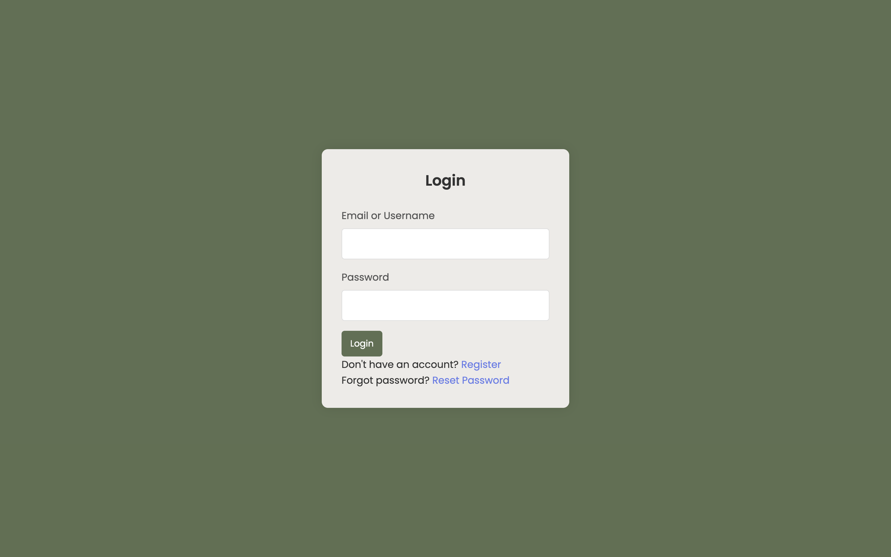
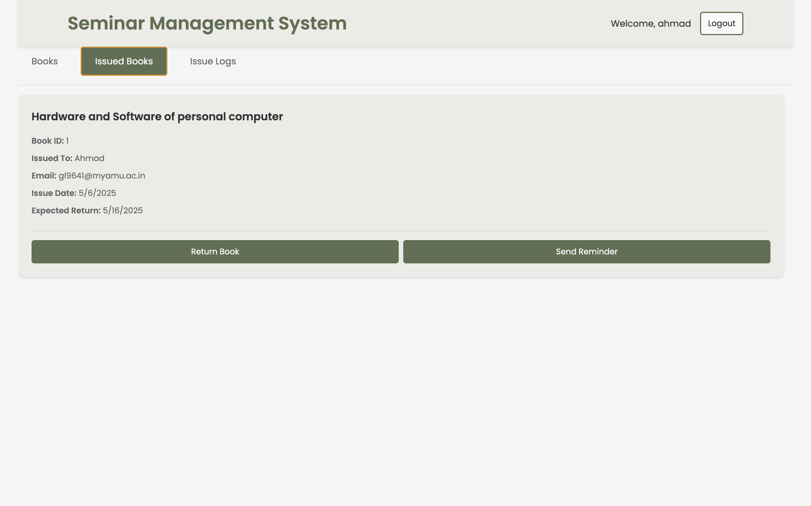
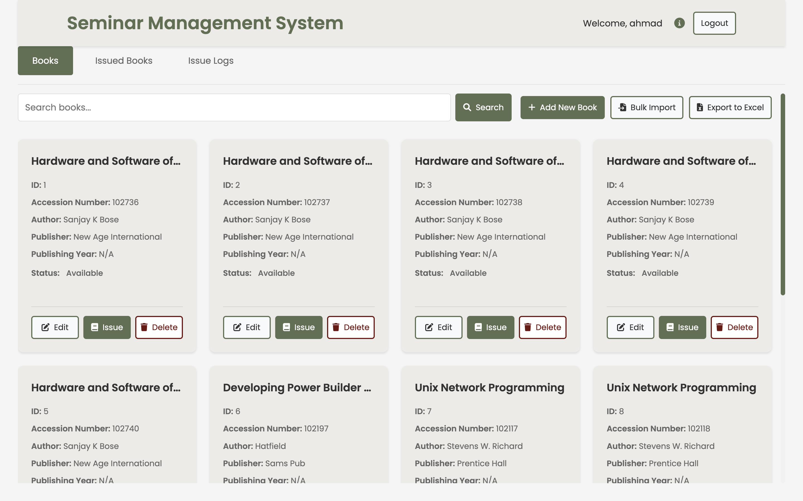
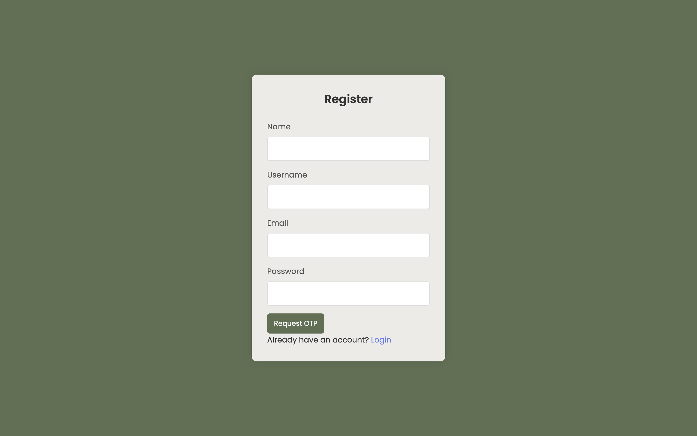

# Seminar Management System

A desktop application for managing seminars, built with Electron and SQLite.


## Features

- User authentication and authorization
- Seminar management
- Email notifications
- Data import/export
- Cross-platform support (Windows and macOS)
- Persistent data storage

## Prerequisites

- Node.js (v14 or higher)
- Python (v3.8 or higher)
- npm (v6 or higher)
- Git

## Download

### Latest Release
- [macOS (DMG)](https://github.com/yourusername/seminar-management-system/releases/latest/download/Seminar-Management-System.dmg)
- [Windows (NSIS Installer)](https://github.com/yourusername/seminar-management-system/releases/latest/download/Seminar-Management-System-Setup.exe)

## Installation

### macOS Installation

1. **Using DMG Installer (Recommended)**
   - Download the DMG file from the releases page
   - Double-click the downloaded file
   - Drag the application to your Applications folder
   - Launch the application from Applications or Spotlight

2. **Using ZIP Archive**
   - Download the ZIP file from the releases page
   - Extract the ZIP file
   - Move the application to your Applications folder
   - Launch the application

3. **From Source**
   ```bash
   # Clone the repository
   git clone https://github.com/yourusername/seminar-management-system.git
   cd seminar-management-system

   # Install dependencies
   npm install

   # Start the application
   npm start
   ```

### Windows Installation

1. **Using NSIS Installer (Recommended)**
   - Download the NSIS installer from the releases page
   - Double-click the downloaded .exe file
   - Follow the installation wizard
   - Launch the application from the Start menu or desktop shortcut

2. **Using Portable Version**
   - Download the portable ZIP file from the releases page
   - Extract the ZIP file to your desired location
   - Run Seminar Management System.exe

3. **From Source**
   ```bash
   # Clone the repository
   git clone https://github.com/yourusername/seminar-management-system.git
   cd seminar-management-system

   # Install dependencies
   npm install

   # Start the application
   npm start
   ```

## Configuration

1. Create a `.env` file in the application directory with the following variables:
   ```env
   NODE_ENV=development
   NodeMailer_email=your-email@gmail.com
   NodeMailer_password=your-app-specific-password
   ```

2. For email functionality, you'll need to:
   - Use a Gmail account
   - Enable 2-factor authentication
   - Generate an App Password

## Data Persistence

The application stores all data in a SQLite database located in the application's user data directory:

- **macOS**: `~/Library/Application Support/Seminar Management System/database.sqlite`
- **Windows**: `%APPDATA%\Seminar Management System\database.sqlite`

Your data will persist between application restarts and updates. To backup your data, simply copy the database file from the user data directory.

## Screenshots






## Project Structure

```
seminar-management-system/
├── asset/              # Application assets and screenshots
├── dist/               # Build output directory
├── sql-models/         # SQLite database models
├── main.js            # Main Electron process
├── renderer.js        # Renderer process
├── index.html         # Main application window
├── styles.css         # Application styles
├── package.json       # Node.js dependencies
├── requirements.txt   # Python dependencies
└── README.md          # Project documentation
```

## Database

The application uses SQLite for data storage. The database file is automatically created in the application's user data directory and persists between application restarts.

### Database Backup

To backup your data:
1. Close the application
2. Navigate to the user data directory
3. Copy the `database.sqlite` file to a safe location

To restore from backup:
1. Close the application
2. Replace the `database.sqlite` file in the user data directory with your backup
3. Restart the application

## Contributing

1. Fork the repository
2. Create your feature branch (`git checkout -b feature/amazing-feature`)
3. Commit your changes (`git commit -m 'Add some amazing feature'`)
4. Push to the branch (`git push origin feature/amazing-feature`)
5. Open a Pull Request

## License

This project is licensed under the ISC License.

## Support

For support, email support@example.com or open an issue in the repository. 